<!--
  How this file becomes the page:
  ## is a section title, ### a sub-section.
  An image on its own line fills the column. Two images on consecutive
  lines sit side by side.
  A > quote is a "Learning" card; start it with **Learning**.
-->

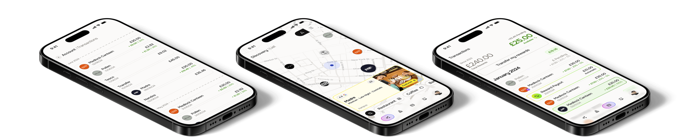

## Introduction

When I joined the Shuffle team in 2023, the company was just a couple of months old and I was the first product and design hire. That left me with an audaciously large goal: help steer the business to launch its first product, and find a foothold in the hugely competitive market it had placed itself in.

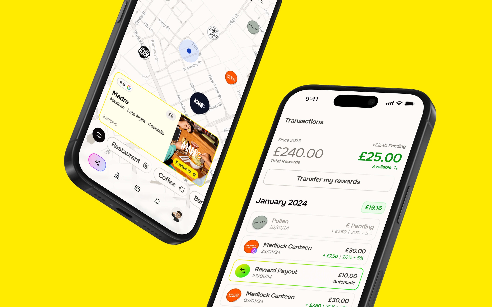

## The problem

Shuffle approached me with their vision: to revolutionise the UK rewards landscape, dominated by giants like Airtime Rewards, Quidco and TopCashback, in the way Monzo had the banking world.

Founders Ollie and Enzo met whilst building Loot (Ollie was a founder) and later Bo, and had come together to build Shuffle around a year earlier. Their idea was a new rewards card with a randomised reward, one that won customers over with gaming dynamics, and with the rewards themselves funded by loans to restaurants and coffee shops.

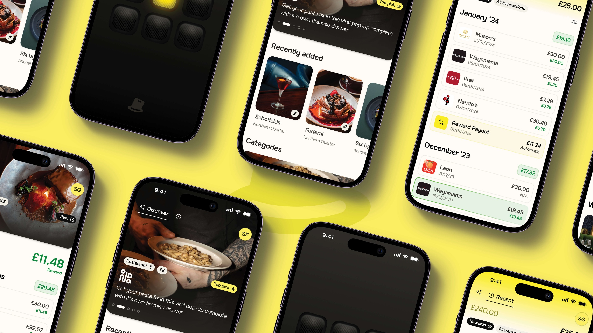

## v0, the investor edition

My first task at Shuffle was to build a quick brand and a “v0” of the product we could present to investors, giving them a clearer picture of what the team had in mind and helping the company secure its first proper round of funding.

**A clickable prototype and an initial brand later, we were ready for that round, and raised £2.5m.**

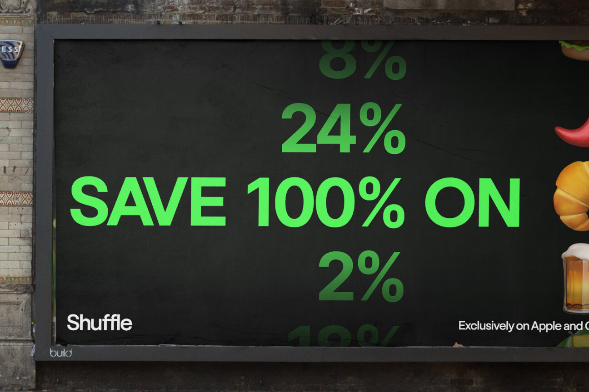
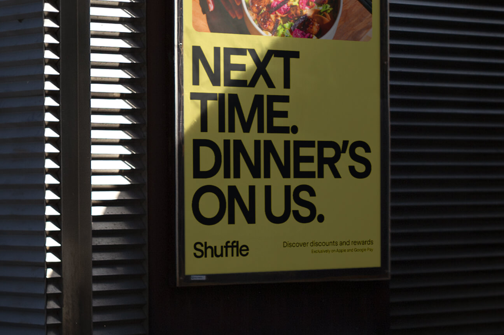

## Launch targeting

To refine our launch approach, we researched the UK hospitality market city by city. Manchester came out on top: a compact city centre, ideal for reaching saturation, and a young population, with over 40% aged between 20 and 40. Add its vibrant restaurant scene and it felt like a match made in heaven.

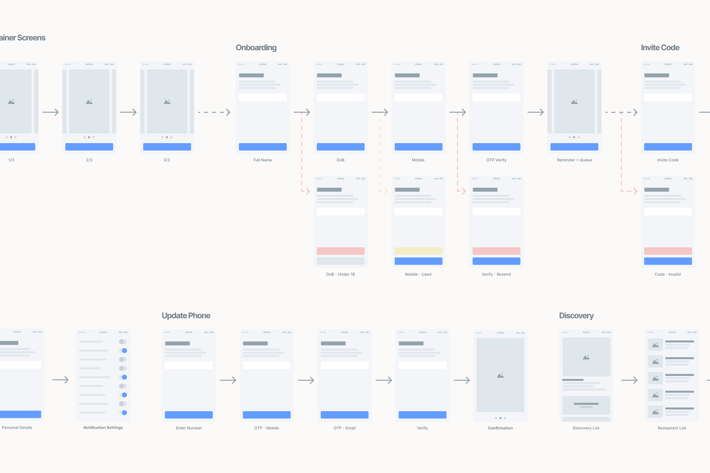

## User research

We took our initial designs and a long list of questions into online sessions with people across our target demographic, digging into their eating habits: how often they went out, where to and who with. From this we narrowed our target audience to Double Income, No Kids couples (DINKs) who eat out at least twice a week and live within 30 minutes of Manchester city centre.

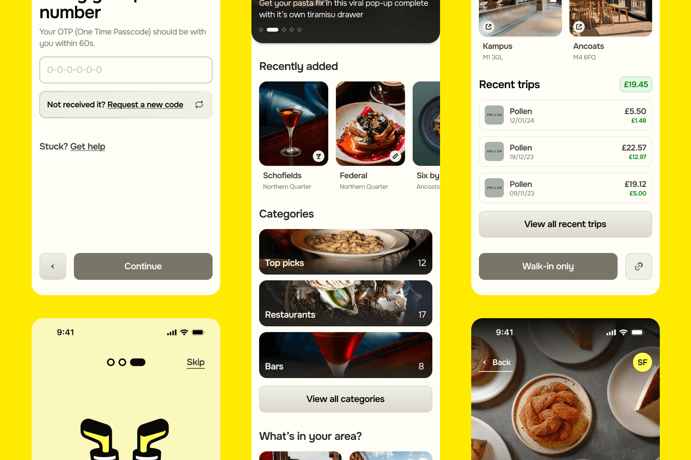

## The Re-Shuffle

As with every startup, the team were on a tight deadline. We wanted to go live by the end of the year (it was now February) and Shuffle still had to gather a number of approvals from the FCA and Mastercard.

**This was where I had an idea.**

What if we offered customers a rewards product with the same app experience, random rewards and a curated list of spots, but instead of issuing our own card, linked to their existing bank account?

> **Learning**
>
> As a result of this idea, Shuffle launched five months early, in August 2024.

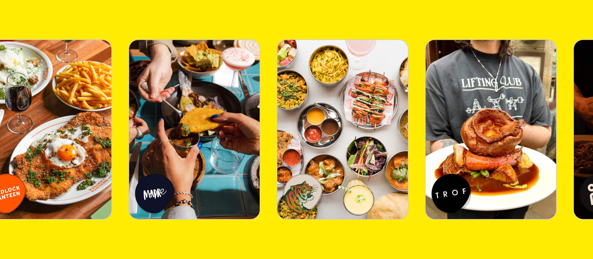

## Branding

Core to structuring Shuffle’s brand was understanding why the company exists. Mixing Simon Sinek’s Why framework with some of the tropes of the Five Whys, I worked with the whole team to define why we existed as a business and how we wanted our users to see us.

Shuffle’s mission is to bring joy to your everyday: highlighting the best of your local area and growing a better community as a result. The brand had to reflect just that.

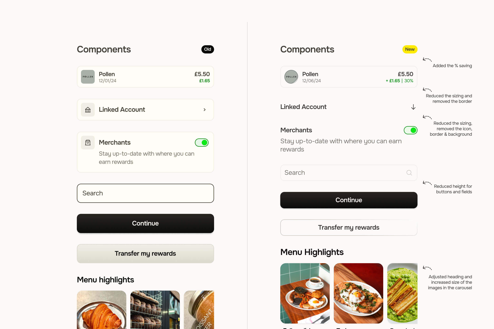

A scaled-back colour palette, Onest (a humanist and geometric sans hybrid) and a real focus on the brands Shuffle would play host to brought the visual identity in line with the company’s goals.

<video src="/img/shuffle/logo.mp4" autoplay muted loop playsinline aria-label="The Shuffle logo animating"></video>

## App design

The app design came in three parts: onboarding, discovery and rewards. Onboarding was vital for building trust, discovery was how we’d get people using the app, and rewards were how we’d get them to stay.

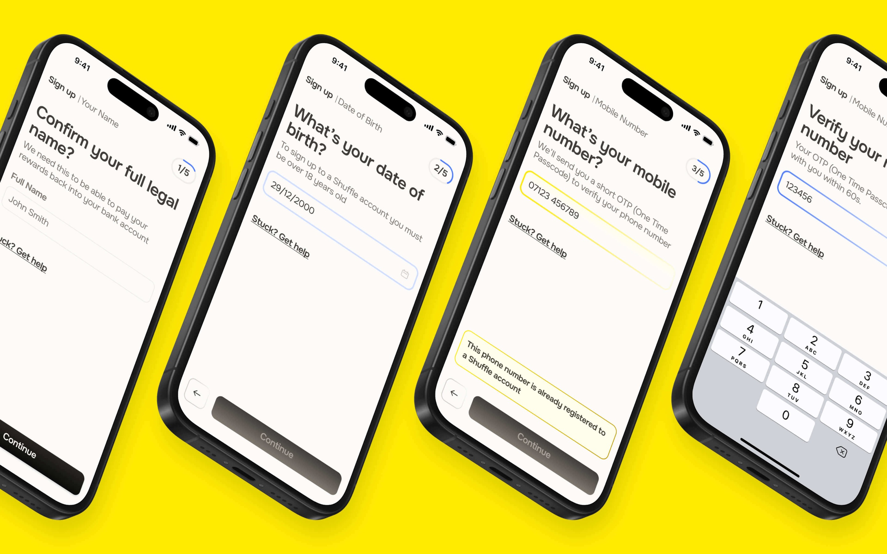

### Onboarding

Alongside collecting basic information, this journey had to earn enough trust for people to connect their bank account to Shuffle. To do that, we asked for as little as possible upfront and repeated the benefits of signing up throughout the flow.

> **Learning**
>
> Re-highlighting features and rewards boosted our conversion rate by around 15%.

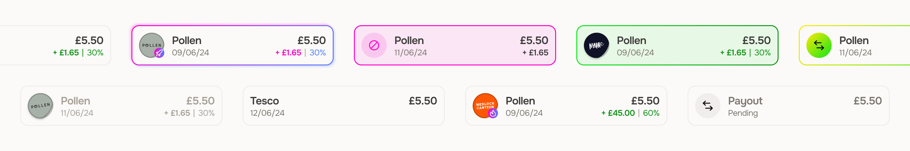

### Rewards

Rewards are the core of the app. Customers get a random discount at any qualifying venue, paid back as cashback into their connected bank account.

To show them, we kept the interface familiar, borrowing from everyday banking apps, and injected personality from our venues, whose logos became stickers. Each transaction showed the cashback earned, alongside monthly and total reward balances.

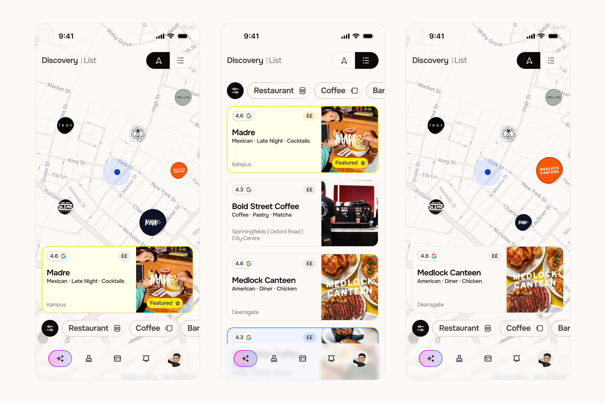

### Discovery, updated

Discovery was the first feature we redesigned after launch. Testing with our first users in Manchester, we found they didn’t know the list of venues as well as our research had suggested, and regularly dipped out to Google Maps to find each one. So we built maps into the app, showing people where they were in relation to Shuffle partners and letting them quickly pick the best spot for a bite to eat, a quick coffee or a post-work drink.

> **Learning**
>
> Maps are more valuable to users, even when lists are small.

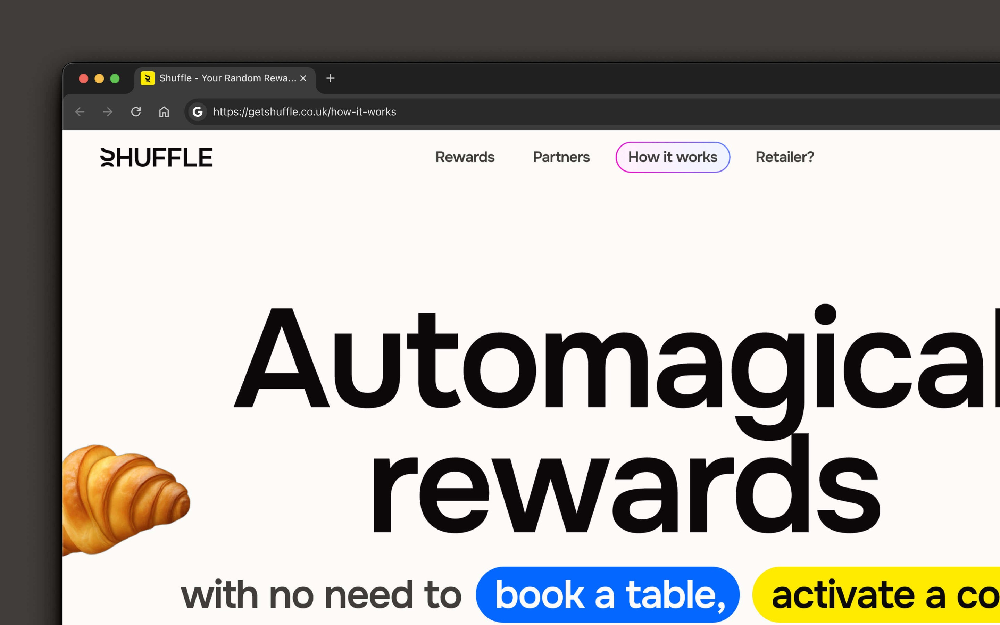
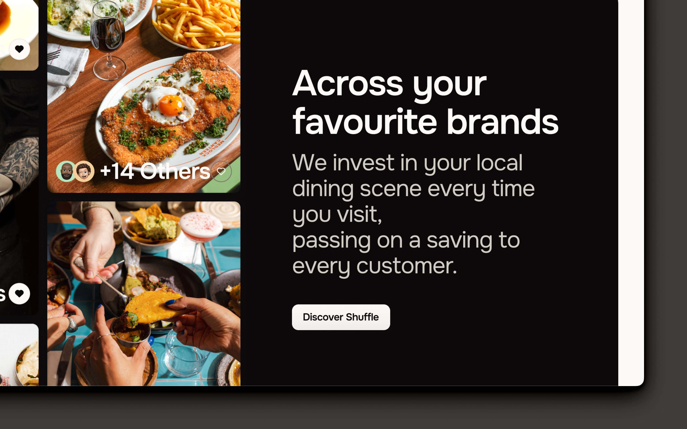

## Design system

As all good designers know, a solid design system makes our work easier and makes it easier to talk with product and development teams as screens come together. At Shuffle I set one up almost from the get-go (you can see some of it above) and worked on it iteratively, building components as and when we needed them.

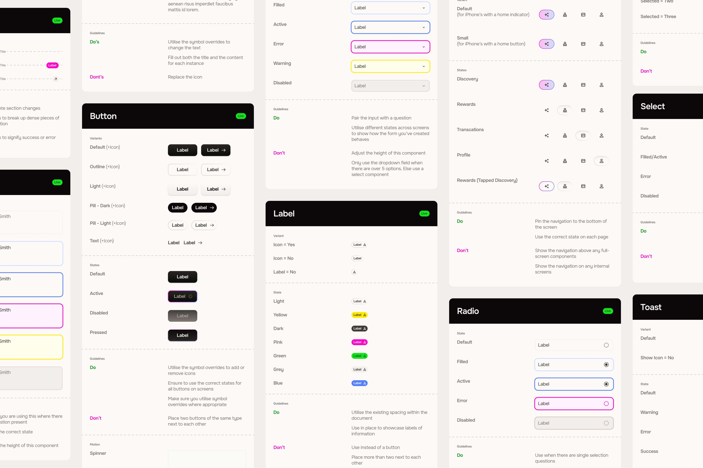

The final piece of the puzzle was documenting it, so the two designers joining after me could keep building screens in the same style. The guidelines served developers and designers alike as the single source of truth for every component: all instances and states (linked to the design file), dos and don’ts for each, and motion guidelines where they mattered.

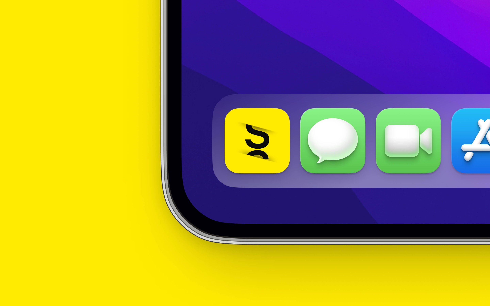

## Launch and learn

Shuffle launched to the public on 13th September 2024, nearly two months after going live with a group of private beta testers.

The app went live with 14 partner venues across Manchester, from the best coffee spots (Pollen and Fort) to the brightest food upstarts (Bundobust, Medlock Canteen and Madre).

The launch was a huge success, with over 1,000 sign-ups in the first week. Retention was strong too, as the features we’d experimented with and tested thoroughly kept pulling people back. The average user clocked around 1.5 visits a month in the first two months, beating the company’s own expectations by around 200%.

> **Learning**
>
> Shuffle’s launch and retention beat the company’s expectations by 200%.
